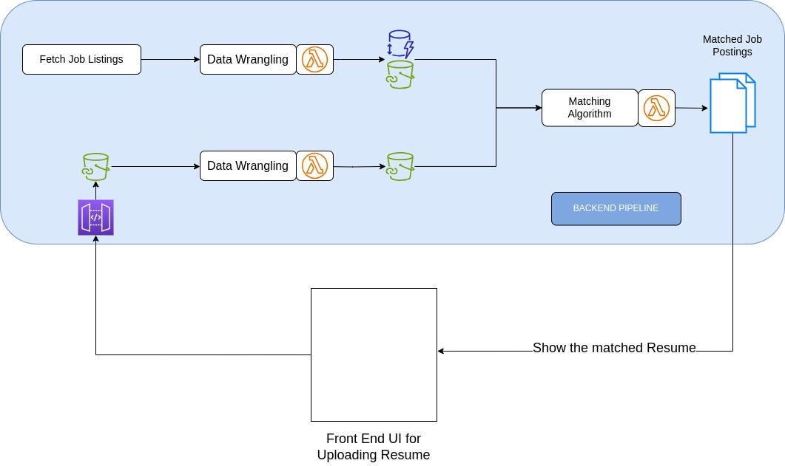
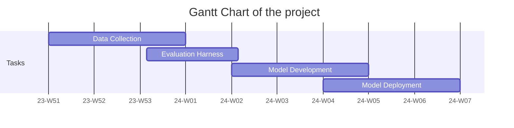

## Business Problem

The business problem is to match qualified candidates with their preferred jobs. 
This builds on the idea that the job market is a two-sided market where both the job seeker and the employer are 
looking for the best match. From a job seeker perspective, we recommend the best matched job postings based on their
preference profile. From an employer perspective, we recommend the best matched candidates based on their job posting.

The traces of effectiveness of the recommendation system can be found in the click through rate
and the conversion rate. While conversion rate is also a function of the level of match between the job seeker and the
job posting, it is harder to measure at this point. For now, we will focus on the click through rate.
The target users are job seekers and employers. But to limit the scope of the project, we will focus from job seekers perspective.
Further, we focus only on data related science and engineering jobs in Canada.

## Metrics
Currently, we are seeking to maximize ad click through rate. However, the metric is not available till its deployed and
used in production. We will need to consider different performance benchmarks that are likely to be positively correlated
with the click through rate. These benchmarks include inference time, and retrieval metrics such as normalized discounted
cumulative(NDCG). We will also consider the cost of infrastructure required to deploy the model and the ongoing mainetenance. 
We consider NDCG for its robustness to the position bias. 

## Data
Now to compute the performance on the above metrics, we will need to collect data and create our data pipeline accordingly. 
The raw data must consists of job posting information, preference profiles. The data will be collected by scraping job postings
from the web such as LinkedIn, Indeed, and Glassdoor etc. The preference profiles will be created artifically and job resumes
are used from the following (TBD). Once the data is collected, we will use various heuristics(TBD) to match job postings with 
seekers resume under different preference profiles.

## Solution
The complete solution architecture is shown in the figure below. The user selects adds their preferences and upload their
resume. The raw resume is shared into an S3 bucket which triggers a lambda function to clean the data in the resume and the 
preference profile. The cleaned data is then stored in another S3 bucket, which triggers another lambda function that matches
job listings, which are then returned as a response to the query. The job listings are then shown in the front-end UI in 
a ranked order. The user can then click on the job listing to view more details. The click data is stored into the same
S3 bucket as the one containing the raw input. 

## Project Planning and Timeline
The end goal of the project is to build a working prototype that fulfils the objective. As a part of the objective,
we are showing a job seeker a list of jobs they are likely to click-on. Clearly, there are traces
of recommendation and information retrieval in this project. As a first step, we will need to collect data to 
evaluate our system. Following which we will create process the data to create a set for training and evaluating the model.
Subsequently, we will develop the model by first building a term-matching based baseline model. Subsequently,
we will build more sophisticated models and measure the performance against the evaluation harness. Once a model has been 
selected, we will deploy the model in production environment and measure the performance. 
As such we have the following timeline:

